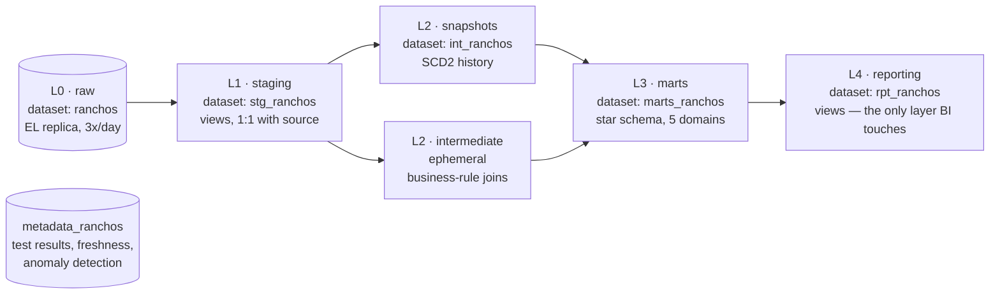

# ranchos-dw

The analytics data warehouse behind a livestock management ERP running
in production — built solo, with dbt and BigQuery, and published
deliberately as a case study. The operational app (Firestore/Firebase,
the actual ERP the ranch staff use day to day) lives in a separate
private repository; its source is not exposed here.

- 5-layer architecture, 5 business domains, 82 dbt models
- 373 automated data-quality tests, covering all 6 DAMA-DMBOK quality dimensions
- 26 source tables replicated 3x/day from the operational database
- Full pipeline orchestration on GCP: BigQuery Data Transfer + Cloud Workflows + Cloud Run Jobs, with email alerting on failure

## Architecture

One BigQuery dataset per layer, on purpose: BigQuery grants IAM
permissions at the dataset level, so this is how a reporting tool gets
read access to L4 without ever seeing raw or intermediate data.

## Engineering decisions worth reading

The full decision log lives in `docs/` and `CLAUDE.md`, in Spanish (the
project's working language) — each entry documents not just what was
built, but what broke first and why. A few worth the click:

- [**Data governance as executable tests, not a slide deck**](docs/dama_governance.md) — every DAMA-DMBOK quality dimension maps to a real, runnable dbt test, not a policy document nobody enforces.
- [**A snapshot bug that only shows up with real historical data**](docs/checkpoint2_movimientos_insumos.md) — the first `dbt snapshot` run assigns `dbt_valid_from = now()` to every row, which silently breaks point-in-time joins against older facts. Fixed with a fallback join, caught by actually inspecting output data instead of trusting green tests.
- [**A reconciliation test that "failed" on purpose**](docs/fase5_reconciliacion_raw.md) — comparing row counts against the live operational source (not just the replica) surfaced a transient false positive, traced to its root cause instead of being patched away.
- [**Orchestrating the pipeline on GCP, with the real bugs included**](docs/fase_orquestacion_dbt.md) — BigQuery Data Transfer, Cloud Workflows, Cloud Run Jobs and Cloud Build wired together, plus the 5 actual issues hit building it (not the sanitized version).
- [**Verifying an alert by actually breaking something**](docs/fase6_alarmas_tecnicas.md) — a forced failure test that revealed the first attempt didn't even count as a failure to dbt, before the second one proved the alert fired end to end.

## Stack

dbt-core + dbt-bigquery, BigQuery Data Transfer Service, Cloud
Workflows, Cloud Run Jobs, Cloud Build, Cloud Monitoring, Elementary
(anomaly detection), sqlfluff.

## More

Local setup, day-to-day commands, and full pipeline/orchestration
detail: [`docs/setup.md`](docs/setup.md).

More about the author: [joseluisalba.com](https://joseluisalba.com)

---

Source-available as a case study. All rights reserved.
